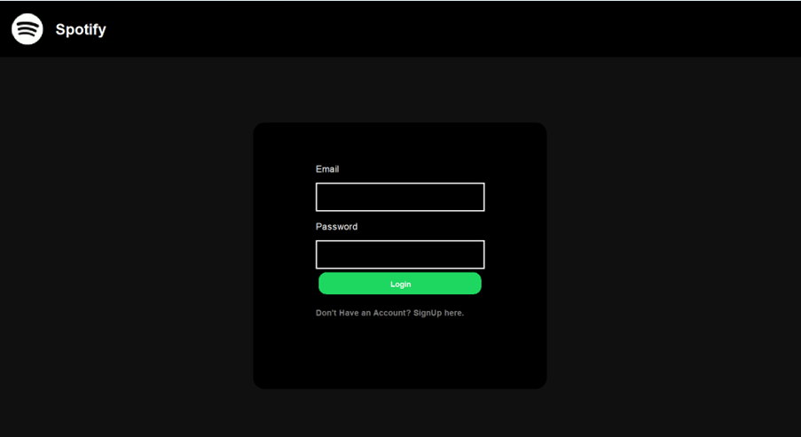
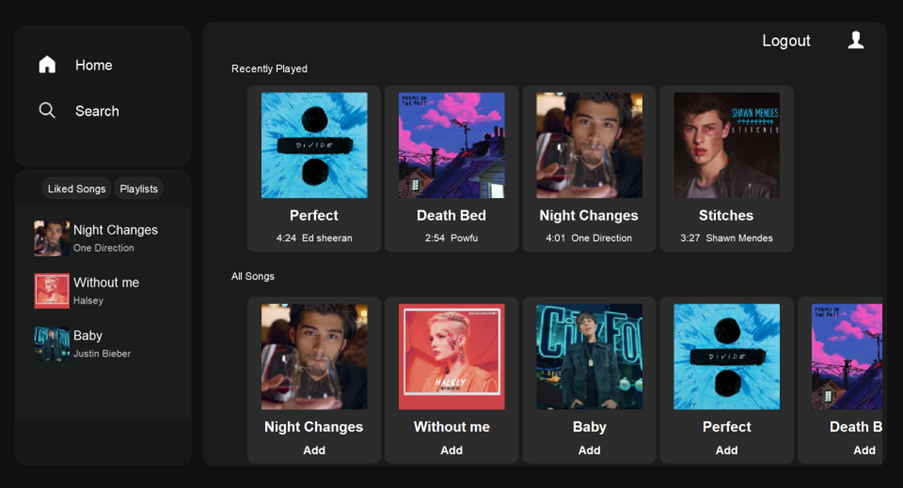
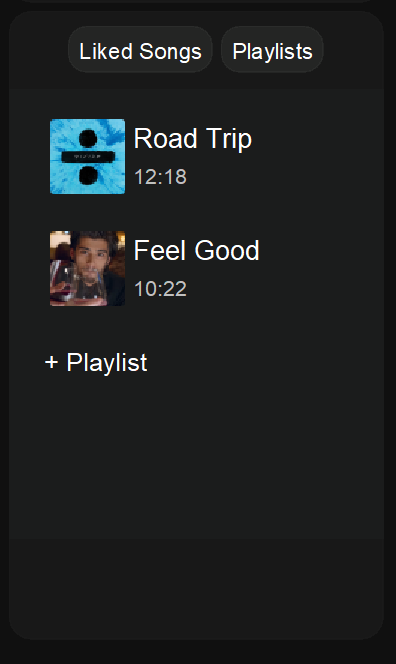
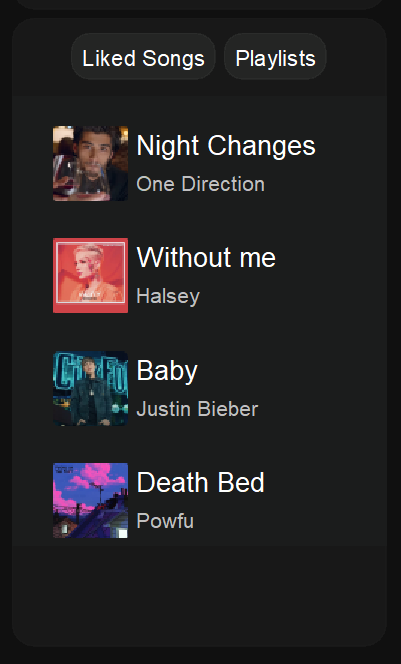
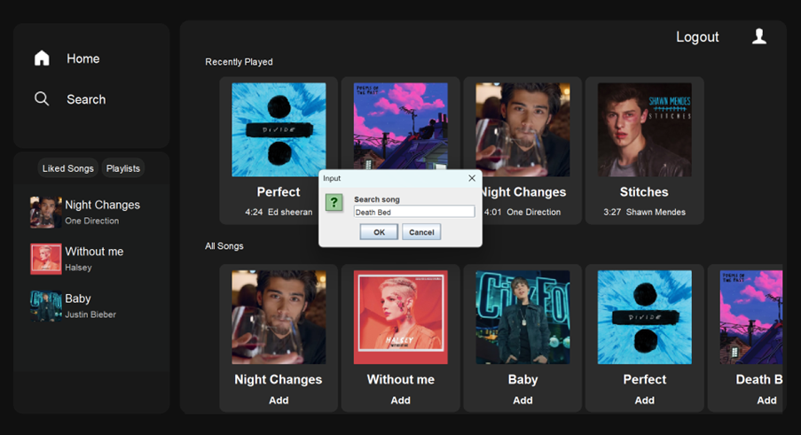

# Spotify Clone

A feature-rich Spotify clone built using Java, allowing users to play music, manage playlists, like songs, and more. The application offers a user-friendly GUI, simulating the core functionalities of Spotify.

## Features

### 1. **User Authentication**
- **Login:** Users can log in using default credentials:
  - **Email:** esha@gmail.com
  - **Password:** Hat123!
- **Sign Up:** New users can sign up with a secure, strong password. The password strength is validated to ensure a secure user experience.



### 2. **Song Playback**
- Users can view a list of available songs on the main page.
- Songs can be:
  - Played
  - Paused
  - Liked/Unliked
- Once a song is selected, album art and song details are displayed.



### 3. **Playlist Management**
- **Add to Playlist:** Users can add songs to an existing playlist or create a new one.
- **Create a Playlist:** New playlists can be created and named by the user.
- **Delete a Playlist:** Users can delete any of their existing playlists.



### 4. **Liked Songs**
- Users can easily view and access all the songs they've liked.
  


### 5. **Search Functionality**
- Users can search for any song by its title from the available song list.
- Search results dynamically update as the user types.



## Project Structure

```bash
project/
├── guis/
│   └── Tester.java   # Main GUI and other guis
├── songs/
│   └── [song_files]  # Folder containing song files
├── images/
│   └── [album_art_images]  # Folder containing album art images
|___ data/
|    └──[ser files]     #folder containing .ser data files
|___ spotifyclone/
|    └──[.java files]   #folder containg the java classes
├── README.md         # This file
└── ...
